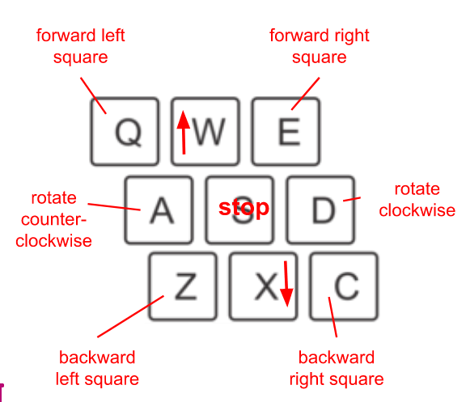
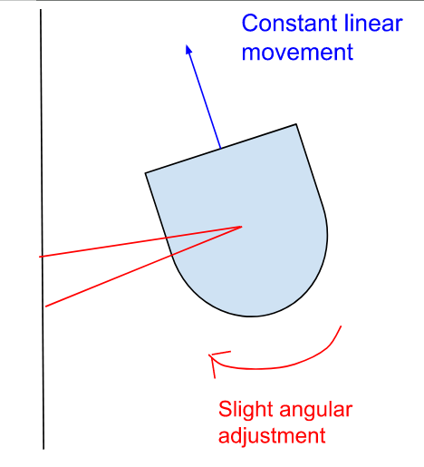
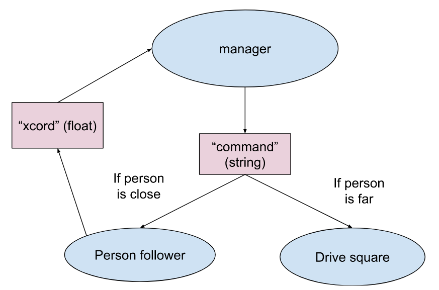
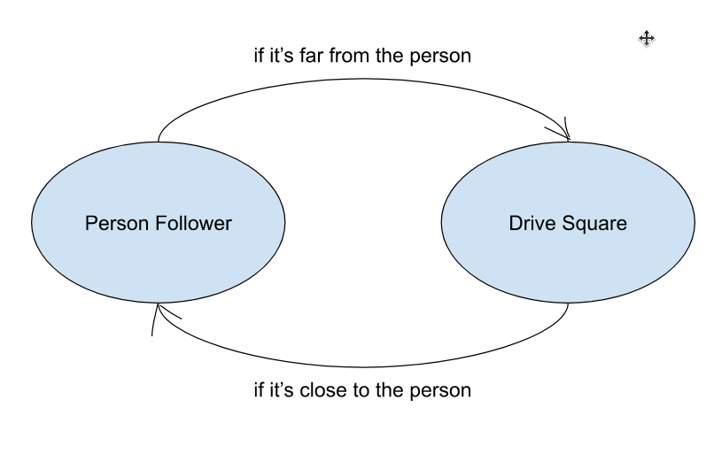

# Warmup Project - Isha Goyal and Maya Cranor

## Introduction
Our goal for this project was to gain familiarity with ROS and feel comfortable using it to implement a range of simple behaviors. We used a combination of Python and ROS2 to program Neatos, which are vacuuming robots. We used data from their laser and bump sensors to achieve the behaviors we wanted. We also used Gazebo, rviz2, and rqt to debug our code and visualize our progress.

## Code Structure
We made a new node class for every behavior we implemented. Each class had a timer run loop in it, at least one publisher (generally to publish a Twist message to tell the robot what to do), and at least one subscriber (to gather data from the relevant sensors) in it. Each sensor subscriber had a callback function to process the data it got. If the behavior was more complicated or had more parts, we had other functions within the class to handle subsections of the behavior, but generally the run loop and callback function were enough.

## Behaviors
### Robot TeleOp
For controlling the robot through teleoperation, we used a getKey function to recognize keystrokes. Then we used a large conditional block to set the linear and angular velocities based on what the key was. We set it up to be the same interactions as for the default teleop code we were given—it keeps driving until you push the stop button, buttons on the diagonals make it drive in circles, etc.

### Driving in a Square
We decided to use timing to execute the driving in a square behavior. The main challenge was in figuring out how to implement the different timing states without having some sort of timer function we could directly access. We ended up using the timer loop to increment a variable, which then acted like a timer we could reference our actions off of. After that, we just had to set the times and speeds of each action, which took a little bit of trial and error. We attempted to figure out what some values should be mathematically, such as the speed at which it rotates in corners and the time we should allow it to rotate to complete 90°, but the actual behavior in the real world ended up being a little different. That required a little bit of tuning through trial and error.

### Wall Following
At a high level, we used the laser scanner readings to determine how parallel we were with the wall we were trying to follow. Depending on whether we were rotated towards or away from the wall, we added an angular movement in the correct direction. Our original implementation used one angle reading and specified a target distance from the wall. However, sometimes the robot didn’t react fast enough with that method, and at other times it would get confused and start spinning in circles. We changed our implementation to use two angles, 85 and 95 degrees, to determine parallelism within one reading rather than on the change in distance from the wall. Since the difference between their distance readings gave us a sense of how off of parallel we were, we were able to make our angular adjustment proportional to the error. This implementation allows the robot to accurately follow a wall and respond to walls that aren’t necessarily straight, however, we have not specified a target distance at which it follows the wall.

### Person Following
We started by assuming that the person/object starts in front of the robot, and that there are no walls nearby in front of the robot. To identify the object, we used laser scan data from 60 to 120 degrees. By averaging the x and y positions of any point that registered in the laser scan data in this range, we were able to find the center of mass. This is the target that the robot will follow. Since if the object is directly in front of the robot, the marker will have an x value of 0, we used whatever the x value was as the error. We then used that to drive the angular movement of the robot. Since that maintained its sign, it was an effective way to proportionally correct the course. We also used the y value as a surrogate for how far we were from the object (understanding that it’s not exact because of potentially being off in the x or from the object having a significant diameter) to make it stop at an appropriate distance. Our biggest challenge was in accounting for the laser scan angles that weren’t hits. We had to find ways to filter those out so as not to throw off our average, and in the case of the simulation, not end up with dividing by zero errors. We did this by using a little counter loop to count hits and the math.isinf() function in an if statement.

[For a demo of our person follower, visit this video](https://youtu.be/3Niid8a5RH4) 

### Obstacle avoidance
We used the same code logic as from our person follower code to detect the object. Once the neato got within a certain distance, we had it turn away from the object using proportional turning. Once it was out of range it could keep driving straight forward.
Finite State Control

## Finite State Control
We had our finite state controller switch between person following and driving in a square, depending on whether the robot was close to a person/object or not. It took us a while to decide how to incorporate the different states. We wanted to reuse our code from the previous problems and keep them contained in their own nodes. So we decided to use a separate node to manage our existing nodes. The manager node would subscribe to the “xcord” topic published by the person follower code to detect the distance from the object. The manager would publish to a topic called “command.” If the object was far from the neato, it would tell the drive square node to allow publishing of the velocity to the neato. If the object was close to the neato, then the drive square code would stop publishing, and the person follower code would start publishing its velocity instead.

[For finite state control video, visit this video](https://youtu.be/yqTAl7L0f8Q) 

## Challenges and Takeaways
Some challenges we faced were with figuring out how to get Gazebo, rviz, the Neato, and our code to work together. Sometimes there would be an issue with one or another and figuring out which part of the pipeline was broken. We also had some difficulty using the documentation for ROS2. It did not seem very self-explanatory to us, and we’re both completely new to ROS.
If we had more time to improve our project, we could try to use more sophisticated tools/methods. For example, figuring out how to use odometry would be a good direction. Maybe making a more sophisticated wall follower, so it could meet both conditions. That would maybe require a finite state controller, which could be another interesting application of that.

### Some of our key takeaways:
Sketching out architecture on whiteboards was really helpful. Especially since programmatic concepts are often hard to visualize and neither of us were familiar with the ROS node and topic structure, having a game plan going in and writing some pseudocode was really nice.
Writing code in small sections and testing it was also really helpful. Because the structure of much of the project is pretty modular, this method makes debugging later much easier. Also, we had a lot of code reuse, as templates for new code, so having good functional code—for example, to get laser scan data or publish a marker—before moving on was helpful.

Don’t eat the Neatos. Because Ayush said so, and we respect Ayush.
Allison is better than ChatGPT at giving ROS2 advice and hugs. We love Allison.
Krishna is cool too. We didn’t talk to him about this project, but he’s a cool guy.

